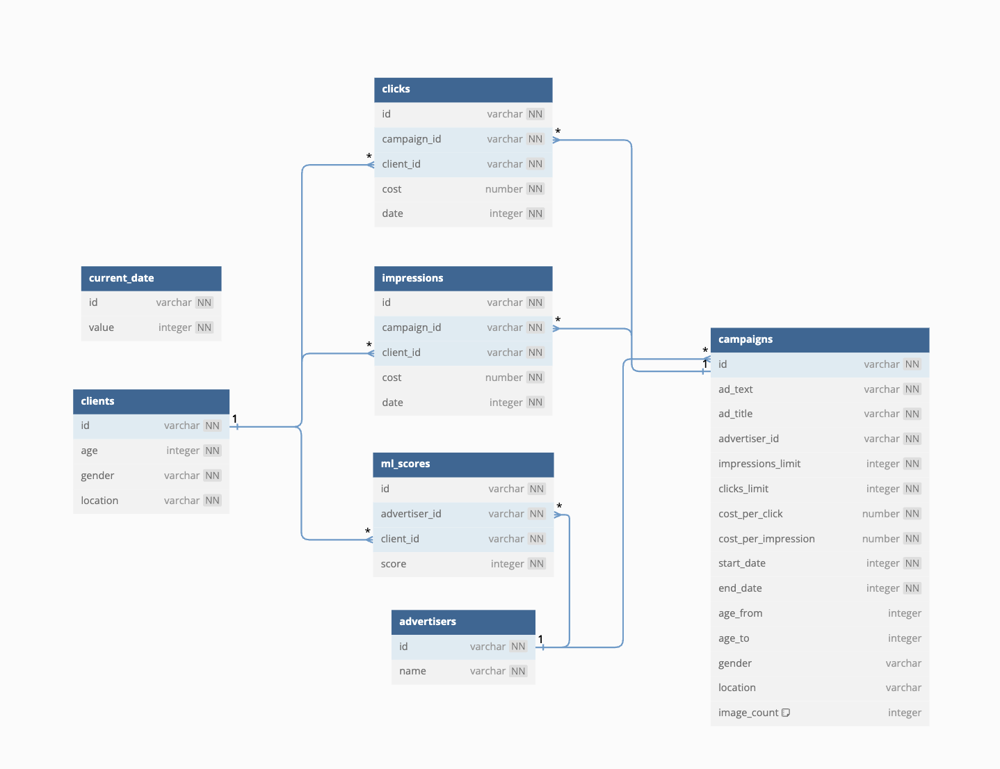

# PROD Backend 2025 Рекламная платформа

Данный проект был написан на Python FastAPI. Я постарался качественно реализовать все предложенные функции, сохраняя чистоту и читаемость кода, а также придерживаясь слоистой архитектуры приложения. Проект разделен на слои инфраструктуры, сервисов и интерфейсов, что позволило мне оперативно интегрировать телеграм-бота и в целом положительно сказалось на процессе работы.
 

## Особенности проекта

### Добавление изображений в рекламных объявлениях

Добавить изображении в рекламное объявление можно используя метод

> PUT /advertisers/{advertiser_id}/campaigns/{campaign_id}/upload_images

Все изображения рекламной кампании таким образом полностью перезаписываются.

Файлы изображения хранятся в S3 хранилище, которое я запускаю в Docker, используя образ Minio. Сервисы S3 обеспечивают удобный доступ к файлам и надежность хранения
  

### Интеграция с LLM для генерации рекламных текстов

Для генерации рекламных текстов я использовал сервис YandexCloud. Я написал сервис для взаимодействия с API нейросети YandexGPT. Подобрав, как мне кажется, хороший промпт, я получаю качественный рекламный текст.

> Смотрите код в файле **/solution/app/services/yandexcloud.py**

Сгенерировать рекламный текст можно отправив POST запрос /text/generate
  

### Модерация текстов рекламных кампаний

Я перепробывал много вариантов реализации этой функции, остановился, как мне кажется, на самом оптимальном в условиях доступных ресурсов и мощностей.

Я нашел несколько датасетов на русском языке в интернете, содержащие благоприятные и неблагоприятные сообщения. Среди них обычные новости, текста про спорт, а также на нежелательные темы, такие как: насилие, расизм, обычная ненормативная лексика и тп. Из этих датасетов я собрал один, содержащий 200.000 строк и всего 2 колонки: текст и оценка. Оценка - значение от 0 до 1, где 0 - это нейтральное сообщение, а 1 - неблагоприятное сообщение

Я обучил модель на этих данных используя лематизацию и линейную регрессию, написал отдельный веб-сервис на FastAPI под эту задачу, так как нужные мне библиотеки требовали версию Python3.9
  

**По умолчанию модерация выключена, но я добавил методы в API для управления:**

`POST /text/moderation/rate` - позволяет установить степень строгости модерации текста, при каждом новом запуске docker-compose.yml устанавливается значение 0, оптимальное значение около 0.7

`POST /text/moderation/check` - позволяет протестировать обученную модель, на произвольном тексте, получив значение **toxicity** - степень неблагоприятности текста

`POST /text/moderation/validate` - принимает текст и возвращает валидность текста

True/False в соответствии с установленным **rate**
  

### **Визуализация статистики**

Для визуализации статистики по нагрузке на систему я запускаю система визуализации данных Grafana, инструмент мониторинга Prometheus, а также агент сбора метрик для операционных систем на базе ядра Linux - Node Exporter

Чтобы просмотреть аналитику, откройте Grafana по адрессу localhost:3000 (username: admin, password: qwerty123). Далее откроейте вкладку Dashboards → Services

Вам доступны три дашборда:

- Host Dashboard - визуализация статистики по нагрузке на ваш хост

- Main API Dashboard - визуализация статистики по нагрузке и входящим запросам на основное приложение на FastApi

- Moderation API Dashboard - визуализация статистики по нагрузке и входящим запросам на микросервис для модерации текстов, о котором было написано выше

  

### Интеграция с Телеграм ботом @prodads_bot

Телеграм бот написан на библиотеке aiogram и работает на вебхуках, для этого я добавил в docker-compose.yml контейнер с образом **yuccastream/tuna**.

Сервис [Tuna](https://tuna.am/#features) позволяет создавать публичную ссылку c **https**, что необходимо для локального тестирования вебхуков.

Телеграм бот включает в себя функции для рекламодателей, такие как:

- вход в аккаунт

- создание и обновление рекмных кампаний

- добавление изображений к рекламным кампаниям

- просмотр аггрегированной статистики и статистики по дням

- Также в телеграм боте работает модерация и есть возможность сгенерировать рекламный текст через сервис YandexGPT
    

### Алгоритм подбора рекламы

- строгая фильтрация по таргетированию и лимитам
- подсчет для каждой рекламы потенциальной прибыли (стоимость показа + стоимость клика * конверсия * Ml_score)
- сортировка по принципу:
  1. видел ли клиент рекламу, в начале те рекламы, которые еще не видел
  2. кликал ли клиент на рекламу, в начале те рекламы, на которые еще не кликал
  3. Оценка ((норм. потенциаотная прибыль) * 2 + норм. ML score) в порядке убывания
  4. Берется первый элемент отсортированного списка

### **Схема данных СУБД**

В моем проекте я использую базу данных Postgres

Ниже представлено изображение со схемой таблиц в бд.

Стоит обратить внимание на таблицы **clicks** и **impressions**, которые хранят данные о кликах и просиотрах реклам соответственно, они наследуются от одного класса, так как имеют идентичные поля. Стоит пояснить, что **date** - числовое значение, день клика, а **cost** - актуальная цена на момент клика/просмтра

Значение текущего хранится в таблице **current_date**, где value - числовое значение, порядковый номер дня. Это значение, как и некоторые другие, я кеширую с помощью **Redis**, что позволяет не посылать каждый раз запрос в бд.

В таблице **campaigns** стоит обратить внимание на поле **image_count**, которое всего лишь хранит информацию о количестве изображений в рекламе, используется для формирования ссылок на файлы изображений, которые хранятся в S3 хранилище

Остальные поля соответствуют описанию полей в данной нам спецификации **openapi.yml**

  

### Тестирование

В моем проекте присутствуют e2e и unit тесты.

E2E тесты проверяют работоспособность всех эндпоинтов, кроме эндпоинтов в разде **Features**

Чтобы запустить e2e тесты, откройте папку `solution/tests/e2e` и выполните в ней команду

`tavern-ci .` перед этим установите зависимости из файла `/tests/requirements.txt`

Для тестов запустится docker-compose с тестовой бд и redis
  

Unit тесты проверяют работоспособность некоторых сервисов и функций, таких как:

- Модерация текста

- Алгоритм подбора рекламы
    

### Запуск проекта

Откройте папку `solution/` и выполните команду `docker-compose up --build`

  

## В качестве демонстрации работы приложения, предлагаю взглянуть на скринкаст с тг ботом

https://cloud.mail.ru/public/yVN4/iv5Bon8FE